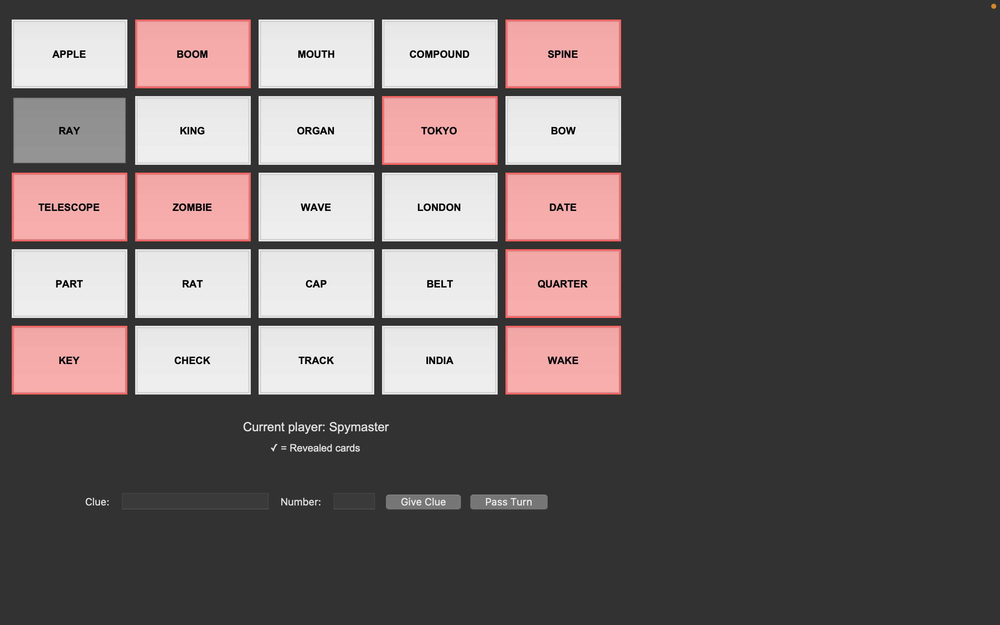

# Games_Python

# Code_names: Rules & Gameplay Guide

**Codenames** is a popular word-based party game involving deduction, word association, and strategic teamwork. This guide explains the game's rules, setup, and winning conditions in a clear and concise format.

---

## Run Code
- create virtual enviroment - python3 -m venv venv
- pip install -r requirements.txt
- python -m scripts.human_vs_human

## Objective

Two teams — **Red** and **Blue** — compete to contact all of their secret agents first. Each team has:
- One **Spymaster**
- One or more **Field Operatives**

The **Spymasters** know the identities of all agents and give one-word clues to help their operatives guess the correct **codenames** (words) on the board.

---

## Setup

- Create a 5x5 grid using **25 word cards**.
- Use a **Key Card** visible only to the Spymasters. It defines:
  - Red agents (8 or 9 words)
  - Blue agents (8 or 9 words)
  - Neutral bystanders (civilians)
  - 1 Assassin

> 🟥 Red always goes first if they have 9 agents.

---

## Gameplay

Teams alternate turns. Each turn consists of:

### Spymaster Phase
- Give **one-word clue** + **number** (e.g., `Water 2`).
  - The clue should relate to exactly that number of words on the board.
  - The clue must not include any visible words on the board.

### Operatives Phase
- Guess words on the grid based on the clue.
- Number of guesses = clue number **+ 1 optional guess**.
- After each guess:
  - ✅ Correct (team’s agent): cover with your team's color.
  - ⚪ Neutral word: cover and end turn.
  - 🔵 Opponent's agent: cover and end turn.
  - 💀 Assassin: game over — your team loses instantly.

---

## Winning

- A team **wins** by correctly identifying **all of their agents**.
- A team **loses immediately** if they guess the **Assassin** word.

---

## Example

Words: `Ocean, Shark, Car, Desert, Apple, Pirate, Moon...`  
Clue: `Water 2`

Possible guesses:
- ✅ Ocean (Red agent)
- ✅ Shark (Red agent)
- Optional third guess? Risky but allowed

---

## Strategy Tips

### For Spymasters:
- Be abstract yet accurate in associating multiple words.
- Avoid giving clues that relate to:
  - Opponent’s words
  - The Assassin word

### For Field Operatives:
- Think creatively and logically.

